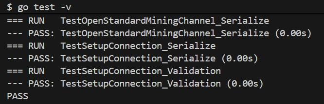

# go-sv2 (WIP) ⚒️

**Golang implementation of the Stratum v2 Mining Protocol.**

* Implementing a Go-based version of the Stratum v2 mining protocol with focus on networking, concurrency and protocol structure.

* Exploring binary message handling, protocol layering and performance-oriented architecture in distributed systems context.

## 🚀 Status: Early Alpha
Current progress: **Handshake Lifecycle Completed**
- [x] `SetupConnection` (Serialization/Deserialization)
- [x] `OpenStandardMiningChannel` (Request/Success flow)
- [x] 24-bit Binary Framing (uint24)
- [x] 100% Test Coverage for implemented messages

## 🛠 Tech Stack
- **Language:** Go (Golang)
- **Math:** Fixed-precision (Decimal) & IEEE 754 (float32)
- **Testing:** Standard `testing` package with binary validation

## 🧪 Quick Start
```bash
go mod tidy
go test -v ./...
```



## 🚧 Roadmap

- [ ] **Noise Protocol Integration** (Encrypted Handshake)
- [ ] **Job Negotiation Protocol**
- [ ] **Template Provider** implementation
